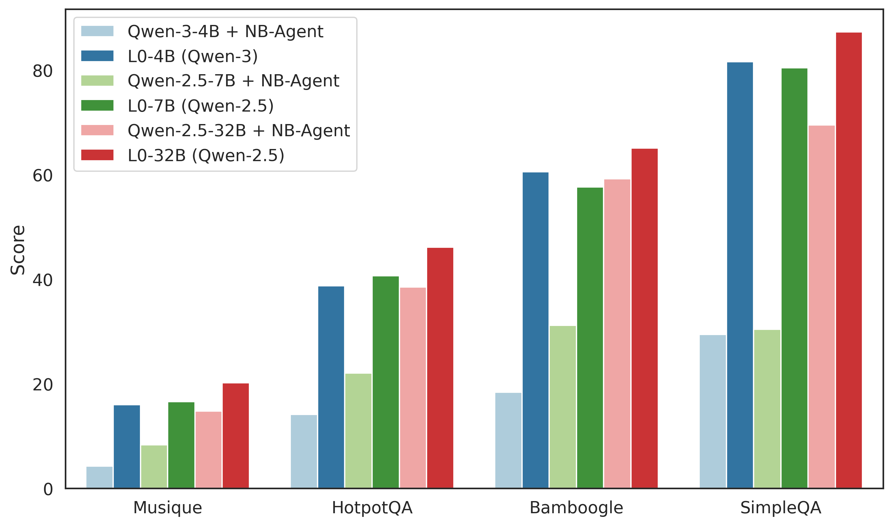
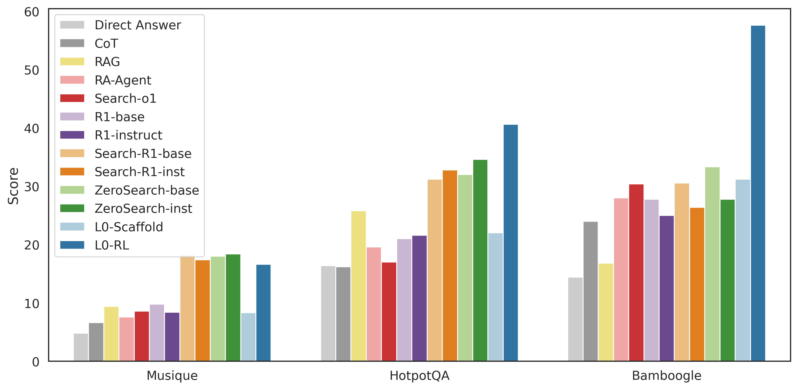

# L0: Reinforcement Learning to Become General Agents

<div align="center">

[](https://deepwiki.com/cmriat/l0)
[](./papers/l0.pdf)
[](https://huggingface.co/cmriat/models)
[](https://zhuanlan.zhihu.com/p/1922271253122748911)


**🤖 A scalable, end-to-end training pipeline for general-purpose agents**

</div>

---

## 🎯 Overview

L0 is a scalable, end-to-end training pipeline for general-purpose agents. We provide you:
* A RL training framework for complex agentic environments, featuring a low-cost, extensible, and sandboxed concurrent agent worker pool.
* A generalist agentic scaffold **Notebook Agent (NB-Agent)** operates in a "code-as-action" fashion via a Read-Eval-Print-Loop (REPL) with Jupyter Kernel.
* A simple yet effective agentic multi-turn training recipe with **agentic policy gradient** and **verifiable multi-step rewards**.
* A series of models trained with L0, including **L0-4B (Qwen 3)**, **L0-7B (Qwen2.5)**, and **L0-32B (Qwen2.5)**. We claim that these models are capable of general agentic tasks, [a case on deep searcher scenario](./examples/nb_agent/deep_searcher_case.md) using **L0-32B (Qwen2.5)** is provided in the examples.

## 📋 Table of Contents

- [L0: Reinforcement Learning to Become General Agents](#l0-reinforcement-learning-to-become-general-agents)
  - [🎯 Overview](#-overview)
  - [📋 Table of Contents](#-table-of-contents)
    - [🏆 Key Results](#-key-results)
  - [🧠 Tech Details](#-tech-details)
    - [Training pipeline](#training-pipeline)
      - [Algorithm](#algorithm)
      - [Infrastructure](#infrastructure)
    - [NB-Agent](#nb-agent)
  - [🚀 Quick Start](#-quick-start)
    - [Installation:](#installation)
    - [Example: Training NB-Agent with REINFORCE++](#example-training-nb-agent-with-reinforce)
      - [Prerequisites](#prerequisites)
      - [Training Scenarios](#training-scenarios)
    - [Using `NB-Agent` Scaffold Alone](#using-nb-agent-scaffold-alone)
    - [Model conversion](#model-conversion)
    - [Serving your own model](#serving-your-own-model)
  - [📊 Evaluation](#-evaluation)
  - [🗂️ Data preprocessing](#️-data-preprocessing)
  - [🛠️ Development](#️-development)
    - [For developing and testing](#for-developing-and-testing)
  - [⚠️ Known Issues](#️-known-issues)
  - [🙏 Acknowledgments](#-acknowledgments)
  - [📖 Citation](#-citation)


### 🏆 Key Results

We significantly improved the model's performance on multiple benchmarks using L0:

* Model name + NB-Agent indicates directly evaluate the model with NB-Agent without training.

L0 also gained competitive performance compared with other works:

* All compared with 7B models

## 🧠 Tech Details

### Training pipeline


#### Algorithm

- **Agentic Policy Gradient**: Optimizes policy gradient for agents, treats a complete "think-code" sequence as a single action
- **Verifiable Reward Function**: Provides multi-faceted rewards for answer correctness, format compliance, and code execution
- **Strict On-Policy Training**: Uses a pure on-policy approach with a KL-divergence penalty for stable learning
- **DAPO-Inspired Rejection Sampling**: Advanced rejection sampling strategy for improved policy optimization

#### Infrastructure

- **Decoupled Architecture**: Separates CPU agent workers from a GPU inference server for independent scaling
- **Flexible server-client architecture**: Scalable agent task execution with FastAPI-based orchestration, you could refer to the [trajectory sampler design document](./docs/design/traj_sampler/arch.md) for more details
- **Lightweight Sandboxing**: Uses Bubblewrap for secure, low-overhead, and parallel agent environments

### NB-Agent

**NB-Agent** is designed to be a general-purpose agent following "Code-as-Action" paradigm. Moreover, it works in a REPL, which allows agents to interact with environments by generating code snippets that are executed in a Jupyter Notebook environment. 


* You could refer to the [NB-Agent Documentation](./docs/design/nbagent/arch.md) for more details on the design and architecture of NB-Agent.

## 🚀 Quick Start

### Installation:
```bash
# Clone this repository
git clone --recurse-submodules https://github.com/cmriat/l0.git
cd l0
```
We use **Pixi** for package management. 

* Pixi is a fast, reliable, and cross-platform package manager for Python and other languages. Visit [pixi.sh](https://pixi.sh/latest/installation/) to learn more and install it.

```bash
# Install Pixi if you haven't already
# curl -fsSL https://pixi.sh/install.sh | bash

# Bypass the default CUDA version check 
# export CONDA_OVERRIDE_CUDA=12.9 

# Enter the environment
pixi shell
```

### Example: Training NB-Agent with REINFORCE++

This example demonstrates training a NB-Agent using the REINFORCE++ algorithm on QA datasets.

#### Prerequisites
**1. Prepare dataset**
```bash
python examples/data_preprocess/l0_qa.py --local_dir ./dataset
```

**2. Start Agent Execution Manager Server**

On the remote machines (1 or more, only consume CPUs):
```bash
bash examples/start_task_server.sh
```

**3. Configure Remote Server URLs**

Edit the training script to specify remote server URLs:
```bash
# File: examples/nb_agent_training/train_qa_reinforcepp*.sh
# Line: actor_rollout_ref.traj_sampler.remote_exec_server_url=['http://IP1:8000', 'http://IP2:8000', 'http://IP3:8000']
```
**4. API Keys Configuration**

Some tools of **NB-Agent** require API keys for external services. The following services are required in QA training:
- **Content Processing**: [Jina](https://jina.ai/) (required)
- **Search Services**: At least one of [Exa](https://www.exa.ai/), [Firecrawl](https://www.firecrawl.dev/), or [Serper](https://serper.dev/) (choose one or more)

Create a `.env` file in the root directory with the configurations of dependent services and some placeholder:

```bash
OPENAI_API_BASE="just fill in place holder"
OPENAI_MODEL_ID="just fill in place holder"
OPENAI_API_KEY="just fill in place holder"
JINA_API_KEY= "YOUR_JINA_API_KEY"
FIRECRAWL_BASE_URL= "YOUR_FIRECRAWL_BASE_URL" # e.g. "http://firecrawl.lionrock.com"
EXA_API_KEY= "YOUR_EXA_API_KEY"
SERPER_API_KEY= "YOUR_SERPER_API_KEY"
```

**5. Running in Container**

Since L0 uses bubblewrap to isolate environments of agent rollouts, if you want to run it in a container, you need to give your container the following capabilities:

- `security-opt`: `apparmor=unconfined`
- `CAPABILITY`: `ALL`

Or you could use `--privileged` to give the container all capabilities, which is not recommended for security reasons.

#### Training Scenarios

**⚠️ Important**: Start the remote task server first before running any training scripts. The task server can be launched locally or on a remote CPU-only machine. Ensure that both the training script and task server run under the same environment and workspace (this may require a distributed file system to share path between instances).

**Choose Your Training Configuration**

Select the appropriate training script based on your hardware setup and model size requirements.

**1. Single Node Training**

For single-node setups with limited GPU resources:

- **0.6B Model (Qwen3-0.6B)**
  - **Hardware Requirements**: 1 node, 1 GPU
  - **Command**:
    ```bash
    bash examples/nb_agent_training/train_qa_reinforcepp_dynamic_0.6b.sh
    ```

- **4B Model (Qwen3-4B)**
  - **Hardware Requirements**: 1 node, 8 GPUs
  - **Command**:
    ```bash
    bash examples/nb_agent_training/train_qa_reinforcepp_dynamic_4b.sh
    ```

**2. Multi-Node Training**

For larger models requiring distributed training, you need to set up a Ray cluster first:

**Step 2.1: Launch Ray Cluster**

```bash
# On the head node:
ray start --head --dashboard-host=0.0.0.0

# On worker nodes:
ray start --address=YOUR_HEAD_NODE_IP:6379
```

**Step 2.2: Submit Training Jobs**

- **7B Model (Qwen2.5-7B-Instruct)**
  - **Hardware Requirements**: 2 nodes, 16 GPUs
  - **Command**:
    ```bash
    RAY_ADDRESS=YOUR_HEAD_NODE_IP:8265 ray job submit examples/nb_agent_training/train_qa_reinforcepp_dynamic_7b.sh
    ```

- **32B Model (Qwen2.5-32B-Instruct)**
  - **Hardware Requirements**: 8 nodes, 64 GPUs
  - **Command**:
    ```bash
    RAY_ADDRESS=YOUR_HEAD_NODE_IP:8265 ray job submit examples/nb_agent_training/train_qa_reinforcepp_dynamic_32b.sh
    ```


### Using `NB-Agent` Scaffold Alone
* For ease of use, we have packaged NB-Agent. You can install and use it separately via `pixi install nbagent`. 
* In our tests, existing frontier models like Gemini and Claude have demonstrated powerful capabilities under NB-Agent without training. 
* You could refer to the [NB-Agent Example](./examples/nb_agent/deep_searcher.ipynb) for a deep searcher example using NB-Agent.

### Model conversion
We directly adapt conversion scripts from verl. It's under `examples/model_converter.py`. Please refer to the [verl model converter document](https://verl.readthedocs.io/en/latest/advance/checkpoint.html#convert-fsdp-and-megatron-checkpoints-to-huggingface-format-model) for usage after training.

### Serving your own model
Since `NB-Agent` needs to use the tokenizer of the model, we patch SGLang to provide extra endpoints. You could refer to the [example patched SGLang server document](./evaluation/nb_agent_eval/README.md) for launching a patched SGLang server.

## 📊 Evaluation
We provide an evaluation suite for QA datasets with an agent worker pool to parallelize sampling. You could refer to the [evaluation document](./evaluation/nb_agent_eval/README.md) for more details.

## 🗂️ Data preprocessing
We provide a data preprocessing pipeline for QA datasets, which includes downloading, merging, quality assessment, and filtering. You could refer to the [data preprocessing document](./data/README.md) for more details.

## 🛠️ Development

### For developing and testing

```bash
# Install development dependencies
pixi install --env dev

# Enter the development environment
pixi shell -e dev

# Install pre-commit hooks
pre-commit install

# Running Tests
pytest ./tests
```

## ⚠️ Known Issues

* If you encounter Out of Memory (OOM) errors during SGLang server capture CUDA graph, you could try to launch ray cluster first and then submit your training script. You can refer to the multi-node training section. It also works for single node training.


## 🙏 Acknowledgments

- This project adapts code from the [verl](https://github.com/volcengine/verl) and the [SGLang](https://github.com/sgl-project/sglang). We are grateful for their contribution to the open-source community.
- Thanks to [Open-Reasoner-Zero](https://github.com/Open-Reasoner-Zero/Open-Reasoner-Zero) and [DAPO](https://github.com/BytedTsinghua-SIA/DAPO) for sharing their training techniques and insights.
- Special thanks to the [Pixi](https://pixi.sh) team for their excellent package management tool, which greatly simplifies our development process.

---

## 📖 Citation
If you find this project useful, please cite it in your research:

```bibtex
@misc{liconrockai2025l0,
      title={L0: Reinforcement Learning to Become General Agents}, 
      author={Lionrock-AI},
      year={2025},
      URL="https://github.com/cmriat/l0/tree/main/papers/l0.pdf"
}
```