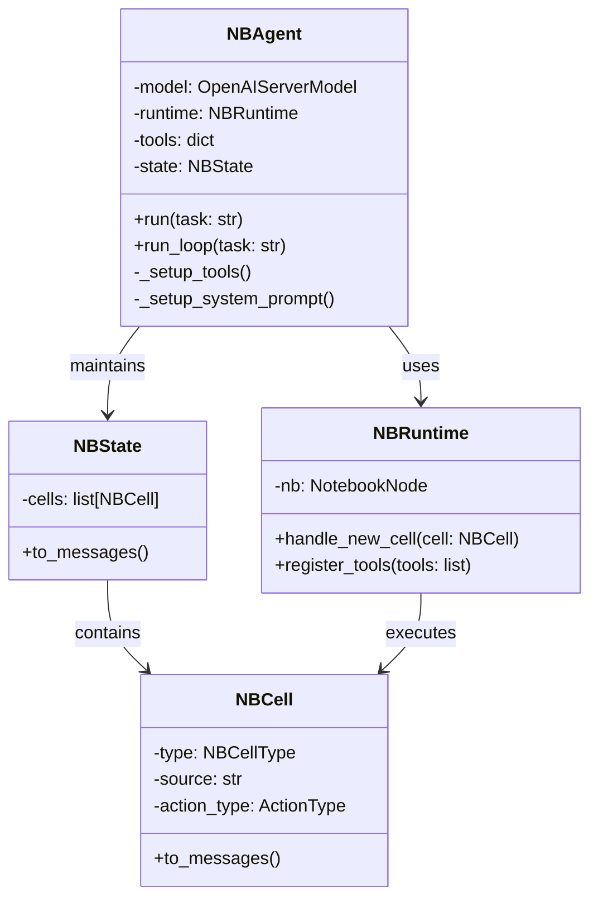
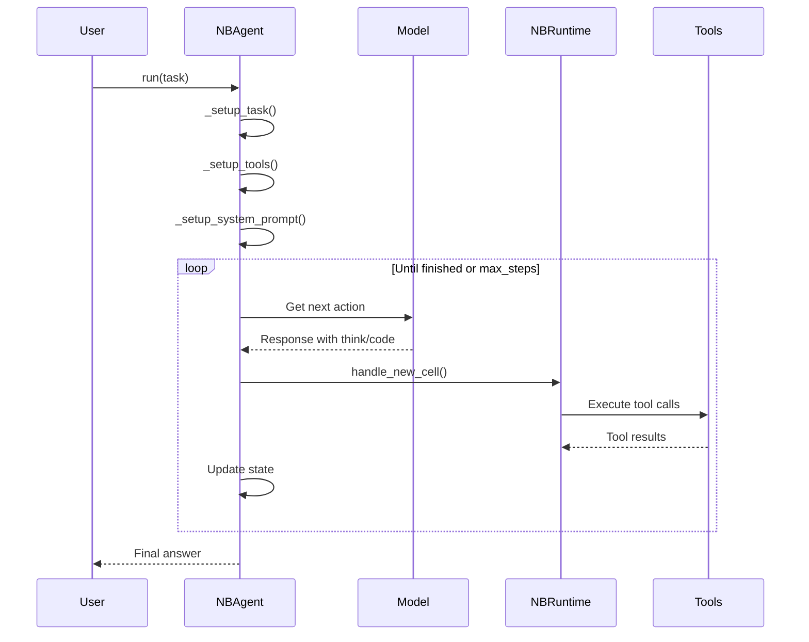
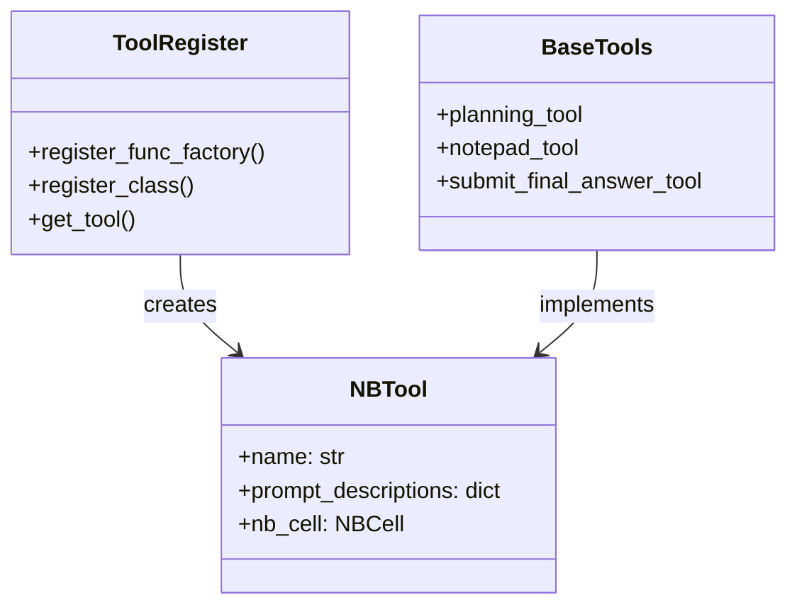
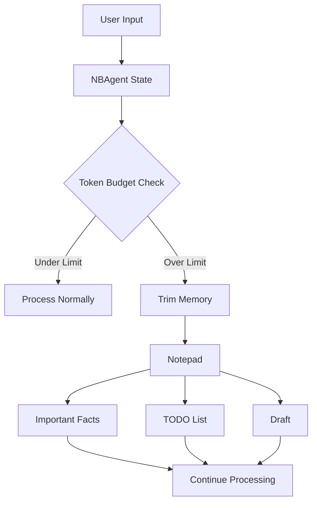

# NBAgent

NBAgent is a notebook-based agent that executes tasks through a Jupyter notebook interface. It maintains state through notebook cells and provides tools for task execution.

## Architecture

## Execution Flow

## Key Components

### 1. NBAgent
- Main agent class that orchestrates the execution
- Maintains state through notebook cells
- Handles tool registration and execution
- Manages conversation with the model

### 2. NBRuntime
- Manages Jupyter notebook execution
- Handles cell creation and execution
- Manages kernel lifecycle
- Registers tools in the notebook environment

### 3. NBState
- Represents current notebook state
- Contains list of cells
- Converts state to messages for model input

### 4. Tools System

## Memory Management

## State Management

The agent maintains state through:
1. Notebook cells (NBCell)
2. Shared memory for:
   - TODO list
   - Important facts
   - Draft content
   - History tokens
   - Final answer