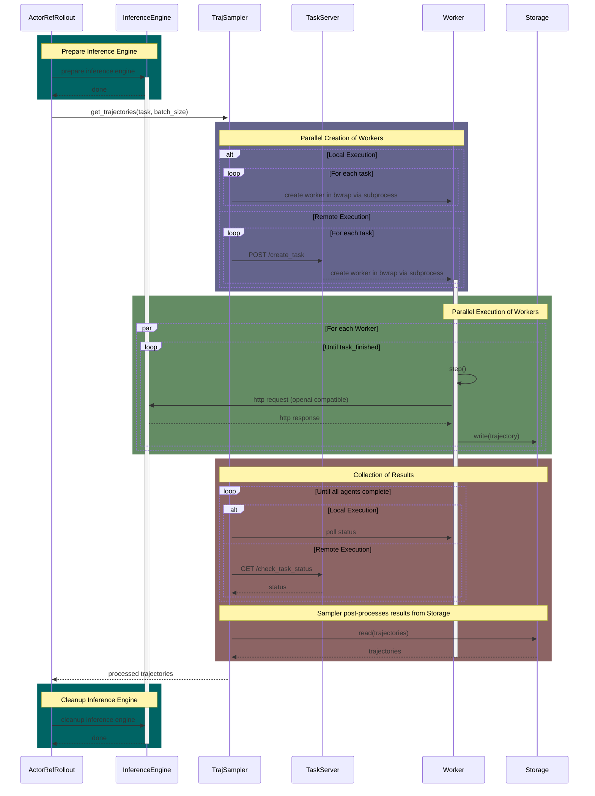

# Trajectory Sampler

```mermaid
sequenceDiagram
    participant ARF as ActorRefRollout
    participant IE as InferenceEngine
    participant TS as TrajSampler
    participant TSS as TaskServer
    participant Worker
    participant FS as Storage

    rect rgb(0, 100, 100)
        Note over ARF,IE: Prepare Inference Engine
        ARF->>+IE: prepare inference engine
        IE-->>ARF: done
    end

    ARF->>+TS: get_trajectories(task, batch_size)

    rect rgb(100, 100, 140)
        Note over TS,Worker: Parallel Creation of Workers
        alt Local Execution
            loop For each task
                TS->>+Worker: create worker in bwrap via subprocess
            end
        else Remote Execution
            loop For each task
                TS->>TSS: POST /create_task
                TSS-->>+Worker: create worker in bwrap via subprocess
            end
        end
    end

    rect rgb(100, 140, 100)
        Note over Worker,FS: Parallel Execution of Workers
        par For each Worker
            loop Until task_finished
                Worker->>Worker: step()
                Worker->>IE: http request (openai compatible)
                IE-->>Worker: http response
                Worker->>FS: write(trajectory)
            end
        end
    end

    rect rgb(140, 100, 100)
        Note over TS,FS: Collection of Results
        loop Until all agents complete
            alt Local Execution
                TS->>Worker: poll status
            else Remote Execution
                TS->>TSS: GET /check_task_status
                TSS-->>TS: status
            end
        end
        Note over TS, FS: Sampler post-processes results from Storage
        TS->>FS: read(trajectories)
        FS-->>TS: trajectories
        deactivate Worker
    end

    TS-->>ARF: processed trajectories

    rect rgb(0, 100, 100)
        Note over ARF,IE: Cleanup Inference Engine
        ARF->>IE: cleanup inference engine
        IE-->>ARF: done
        deactivate IE
    end
```
